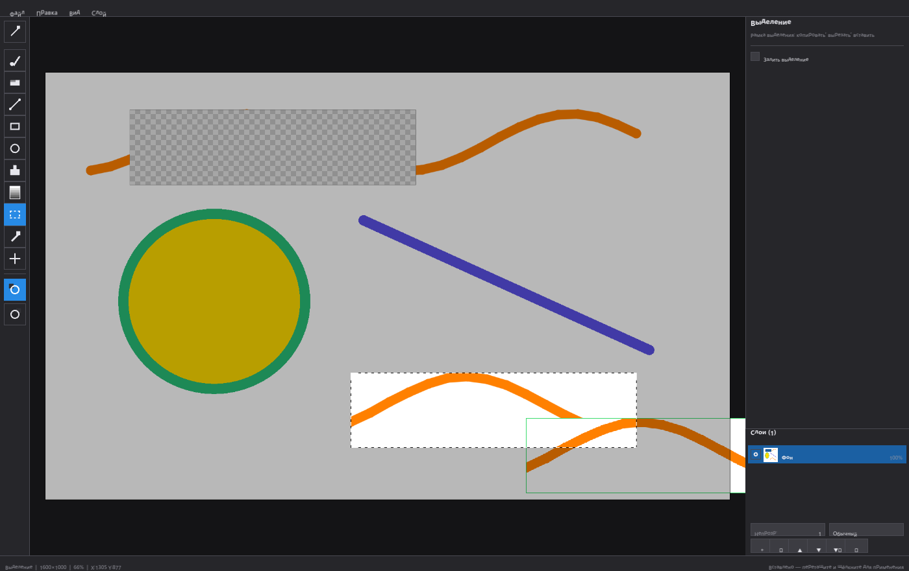

# TPaint — растровый редактор в духе Clip Studio

Графический редактор для Windows на **Rust**: окно и OpenGL-контекст создаёт **GLFW**,
весь интерфейс (панели, кнопки, колорпикер, текст) рисуется собственным
immediate-mode UI на OpenGL. Никаких Win32-контролов и системных диалогов —
включая выбор цвета и окно открытия файла: они тоже свои.



## Возможности

**Инструменты** (свои параметры у каждого):

| Инструмент | Параметры |
|---|---|
| Карандаш | толщина, непрозрачность, сглаживание |
| Кисть | размер, непрозрачность, мягкость края, сглаживание |
| Ластик | размер, непрозрачность, мягкость края, сглаживание |
| Линия | толщина, непрозрачность |
| Прямоугольник | толщина, непрозрачность, заливка фигуры |
| Эллипс | толщина, непрозрачность, заливка фигуры |
| Заливка | непрозрачность, допуск, ограничение области |
| Градиент | непрозрачность, мягкость края |
| Выделение | залить выделение |
| Пипетка | — |
| Рука | панорамирование холста |

**Выделение** (`M`) — прямоугольная рамка с «муравьиными дорожками» и затемнением
вокруг. Внутри рамки содержимое можно перетаскивать мышью, снаружи — рисовать
новую. Поддержаны копирование, вырезание, вставка, удаление, «выделить всё» и
снятие выделения; вставленный фрагмент висит под курсором и закрепляется
щелчком (как в Clip Studio). Все операции отменяются через Ctrl+Z.

**Слои** — добавление, дублирование, удаление, порядок, видимость, непрозрачность
и режим наложения (обычный, умножение, экран, наложение, добавить). В панели
слоёв у каждого слоя настоящая миниатюра.

**Цвет** — два цвета (основной и запасной, как в Clip Studio), обмен по `X`,
собственный колорпикер: квад S/V, полосы тона и прозрачности, поля R/G/B, ввод HEX,
палитра.

**Прочее**

- история действий: отмена/повтор (Ctrl+Z / Ctrl+Y), в том числе для слоёв;
- сохранение и открытие PNG (Ctrl+S / Ctrl+O) в собственном модальном окне;
- масштаб колесом мыши, панорамирование средней кнопкой, пробелом или «Рукой»;
- сглаживание мазка (стабилизатор), мягкая кисть с нажимом по краю;
- тёмная тема, DPI-осведомлённость, сглаживание MSAA.

## Горячие клавиши

| Клавиши | Действие |
|---|---|
| `Ctrl+Z` / `Ctrl+Y` | Отменить / Повторить |
| `Ctrl+N`, `Ctrl+O`, `Ctrl+S`, `Ctrl+Shift+S` | Новый, открыть, сохранить, сохранить как |
| `Ctrl+0`, `Ctrl+1`, `Ctrl+=`, `Ctrl+-` | Вписать, 100 %, приблизить, отдалить |
| `X`, `[`, `]` | Обмен цветов, тоньше, толще |
| `P B E L R O F D M I H` | Карандаш, кисть, ластик, линия, прямоугольник, эллипс, заливка, градиент, выделение, пипетка, рука |
| `Ctrl+A`, `Ctrl+C`, `Ctrl+X`, `Ctrl+V` | Выделить всё, копировать, вырезать, вставить |
| `Esc` | Снять выделение (и закрыть окно диалога) |
| `Shift` + колесо | Размер кисти |
| `Alt` + ЛКМ | Временно взять пипетку |
| ПКМ | Рисовать запасным цветом |
| `Delete` | Очистить слой (или выделение, если оно есть) |
| `F12` | Снимок окна в `tpaint_shot.png` |

## Сборка

Нужен только [Rust](https://rustup.rs/) (stable) и **CMake** — он нужен крейту
`glfw-sys`, который собирает GLFW из исходников. В Visual Studio Build Tools
CMake уже есть (`C:\BuildTools\Common7\IDE\CommonExtensions\Microsoft\CMake\CMake\bin`),
достаточно добавить его в `PATH`.

```bat
cargo build --release
```

Готовый файл: `target\release\tpaint.exe`.

Линковка на Windows делается через MSVC (Visual Studio Build Tools 2022 с
компонентами «MSVC v143» и «Windows 10/11 SDK»). Альтернатива — MinGW-w64:

```bat
rustup target add x86_64-pc-windows-gnu
cargo build --release --target x86_64-pc-windows-gnu
```

> В `Cargo.toml` у обоих профилей включена оптимизация (`opt-level > 0`,
> `debug = false`): cmake-rs выбирает конфигурацию CMake по профилю cargo, и
> при `opt-level = 0` он собрал бы GLFW как Debug, а MSVC в Debug использует
> debug-CRT, несовместимый с тем, что линкует Rust.

### Зеркало crates.io

В `.cargo/config.toml` crates.io заменён на зеркало USTC — это нужно в сетях,
где `crates.io` недоступен. Если прямой доступ работает, файл можно удалить.

## Устройство проекта

```text
src/
  main.rs      — окно GLFW, главный цикл, ввод, горячие клавиши
  app.rs       — состояние: холст, слои, инструменты, история, файлы
  doc.rs       — документ и слои: буферы RGBA, композитинг, операции
  raster.rs    — кисть, линии, фигуры, заливка, градиент, операции выделения
  tools.rs     — инструменты и наборы их параметров
  renderer.rs  — OpenGL: шейдер, батчи квадов и треугольников, текстуры
  text.rs      — шрифт и атлас глифов (ab_glyph)
  ui.rs        — immediate-mode UI: кнопки, поля, списки, иконки
  palette.rs   — цветовой выбор (HSV/HEX/RGB)
  layout.rs    — компоновка: меню, тулбар, панели, статус-бар
build.rs       — линковка OpenGL и Win32-библиотек для GLFW
```

Весь код — Rust; C в проекте нет (GLFW собирается из исходников крейтом
`glfw-sys`). Зависимости тоже чистые: `glfw` (окно), `gl` (загрузка функций
OpenGL), `ab_glyph` (шрифт), `image` (PNG).

Шрифт берётся из системной папки Windows (`C:\Windows\Fonts\segoeui.ttf`,
`segoeuib.ttf`), при отсутствии — из папки `fonts/` рядом с программой, поэтому
в репозитории нет бинарных шрифтов.

## Тесты

```bat
cargo test
```

Покрыты: растеризация глифов, кисть и её мягкий край, непрерывность линии,
контур эллипса, заливка с учётом стен и режим «по всей картинке», линейный
градиент и его мягкость, композитинг слоёв с непрозрачностью и видимостью,
изменение размера холста, операции со слоями, отмена/повтор мазка, пипетка,
преобразование координат вида, а также выделение: нормализация рамки, обрезка
по краям холста, копирование/вставка, перенос содержимого и отмена.

## Что нового в 0.3.0

- **выделение рамкой** (`M`): «муравьиные дорожки», затемнение вокруг, перенос
  содержимого мышью, копирование/вырезание/вставка/удаление, «выделить всё»;
- **настоящие миниатюры слоёв** — панель слоёв показывает содержимое каждого
  слоя (атлас 8×8 ячеек по 64 px, пересобирается при изменении холста);
- **линейный градиент** (`D`): от выбранного цвета ко второму, с параметром
  мягкости края; правой кнопкой — градиент в обратную сторону;
- **круг текущего размера кисти** под курсором на холсте, как в Clip Studio;
- пункты «Правка» (копировать, вырезать, вставить, выделить всё) и
  прокручиваемый список слоёв;
- исправлены наложение строк в панели слоёв и обрезка палитры инструментов;
- 25 тестов, в том числе на операции выделения и градиент;
- `F12` — снимок окна в PNG (для отчётов об ошибках).

## Лицензия

MIT — см. [LICENSE](LICENSE).
