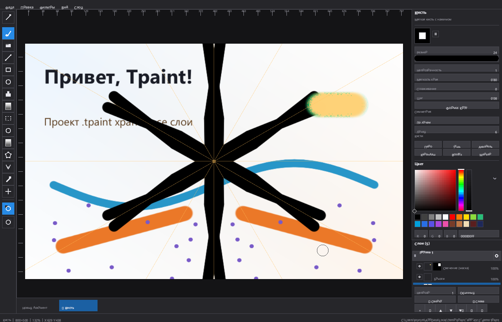
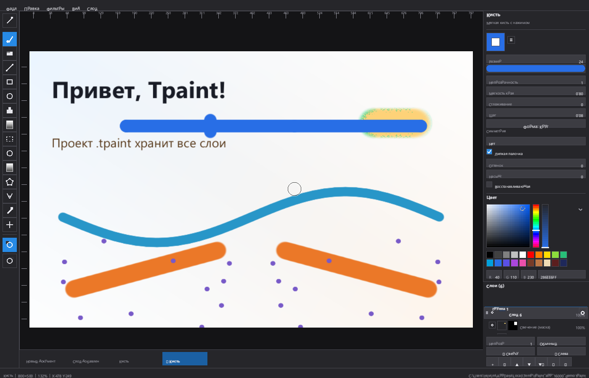
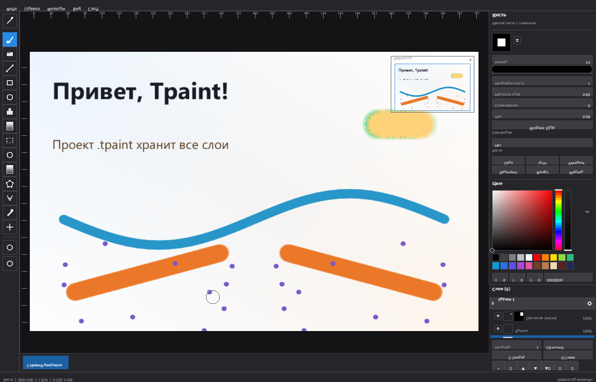
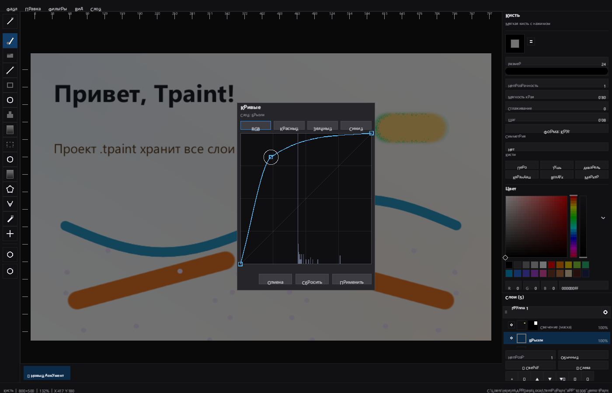
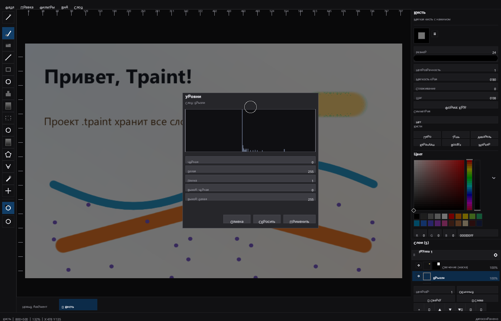
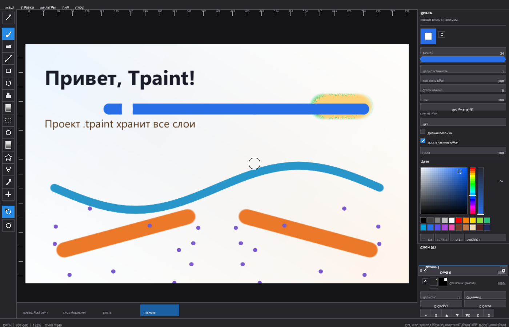
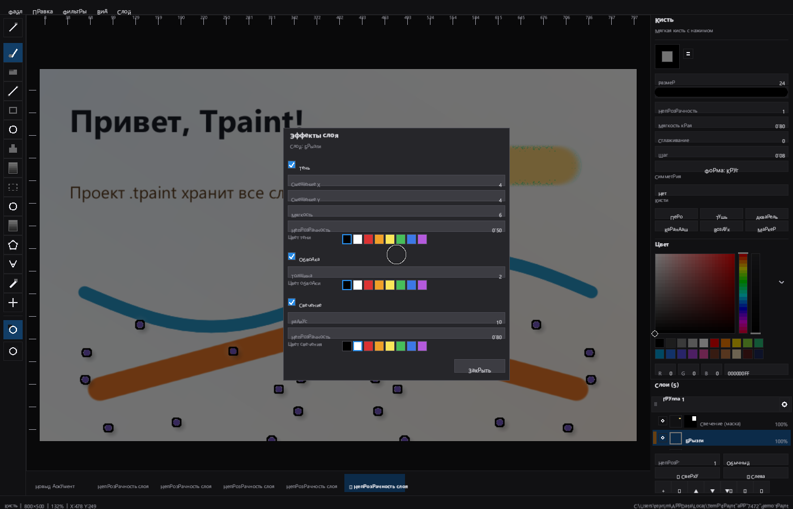
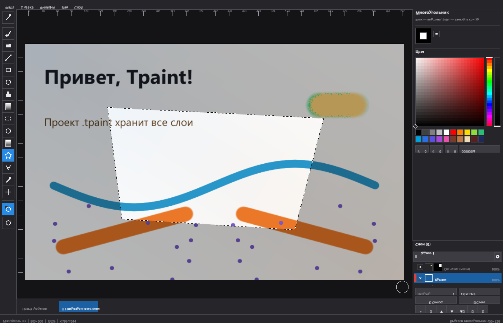

# Tpaint — растровый редактор в духе Clip Studio

Графический редактор для Windows на **Rust**: окно и OpenGL-контекст создаёт **GLFW**,
весь интерфейс (панели, кнопки, колорпикер, текст) рисуется собственным
immediate-mode UI на OpenGL. Никаких Win32-контролов и системных диалогов —
включая выбор цвета и окно открытия файла: они тоже свои.


В репозитории две программы: **редактор** `tpaint.exe` и **лаунчер**
`TpaintLauncher.exe` со стартовым окном (пресеты размера, недавние файлы) —
он запускает редактор с нужным документом.

## Возможности

**Инструменты** (свои параметры у каждого):

| Инструмент | Параметры |
|---|---|
| Карандаш | толщина, непрозрачность, сглаживание |
| Кисть | размер, непрозрачность, мягкость края, сглаживание, форма кисти, симметрия, липкая палочка, восстанавливающая |
| Ластик | размер, непрозрачность, мягкость края, сглаживание, форма кисти, симметрия |
| Линия | толщина, непрозрачность |
| Прямоугольник | толщина, непрозрачность, заливка фигуры |
| Эллипс | толщина, непрозрачность, заливка фигуры |
| Заливка | непрозрачность, допуск, ограничение области |
| Градиент | непрозрачность, мягкость края |
| Выделение | залить выделение, допуск |
| Эллипс-выделение | форма выделения задаётся эллипсом |
| Волшебная палочка | допуск, ограничить область |
| Многоугольник | вершины кликами, `Enter` — замкнуть контур |
| Текст | кегль, непрозрачность, жирный |
| Пипетка | — |
| Рука | панорамирование холста |

У кисти и ластика есть **симметрия мазка**: «нет», «центр» (поворот на 180°),
«вертикаль» и «горизонталь» (отражение по оси через центр холста) и «по лучам» —
радиальная симметрия с 2…12 секторами, где мазок расходится по лучам, а его
отражение замыкает каждый сектор. Оси симметрии рисуются на холсте тонкими
оранжевыми линиями. Ещё у кисти и ластика **шесть пресетов кистей** (Перо, Тушь,
Акварель, Карандаш, Воздух, Маркер), **форма отпечатка** (круг, эллипс или
квадрат), **стабилизатор** (мазок не отстаёт от курсора, но не дрожит) и **шаг
между отпечатками** — он задан в долях диаметра и не зависит от скорости мыши.



Две особые кисти — как в Clip Studio:

- **липкая палочка** — цвет мазка берётся из слоя под курсором, поэтому
  мазок «подхватывает» то, по чему идёт; есть сдвиг оттенка (градусы) и
  насыщенности;
- **восстанавливающая** — в начале мазка снимается кусок слоя размером с
  кисть, и дальше он едет под мазком, затягивая текстуру; сила впечатывания
  настраивается.



**Навигатор** (меню «Вид» → «Навигатор») — маленькая копия холста в углу с
рамкой текущего вида: видно, где мы находимся, а всё, что вне рамки, приглушено.
Щелчок или перетаскивание в окошке двигает холст.

**Маски слоёв** — как в Clip Studio. Кнопка `▦` в панели слоёв создаёт маску из
текущего выделения, клик по миниатюре маски переключает правку: кисть рисует по
маске белым (открывает слой), ластик — чёрным (закрывает). Меню «Слой» умеет
заливать маску целиком, инвертировать, временно выключать и удалять её. В строке
состояния горит «МАСКА», когда идёт правка маски, а у активной цели — белая рамка.

**Папки слоёв** — «Убрать в папку» складывает активный слой и всё выше него в
группу. В панели появляется шапка со стрелкой и отдельным «глазом»: клик по
стрелке сворачивает папку, клик по «глазу» скрывает или показывает её целиком.

**Свободная трансформация** (Ctrl+T) — содержимое выделения поднимается в
плавающий буфер: рамку можно тянуть за углы (масштаб), за середину (перенос) и
за ручку над рамкой (поворот). `Enter` или кнопка «Применить» впечатывает
результат в слой, `Esc` или «Отмена» возвращает всё как было.

**Слой-маска** — «Слой → Прижать к нижнему слою»: прижатый слой виден только
там, где нижний непрозрачен, а в панели слоёв помечен изогнутой стрелкой.
Это удобный способ «цветом нижнего слоя» красить поверх рисунка.

**Эффекты слоя** — «Слой → Эффекты слоя…»: **падающая тень** (смещение по
двум осям, мягкость, непрозрачность, цвет), **обводка** (толщина, цвет) и
**свечение** (радиус, непрозрачность, цвет).
Эффекты неразрушающие: пиксели слоя не трогаются, свечение и тень ложатся под
слой, обводка — по краю рисунка. Включить и выключить эффект можно и одной
командой из меню «Слой» («Тень», «Обводка», «Свечение»), а параметры и флаги
сохраняются в проекте.

**Метки и имена слоёв** — цветная полоска слева в строке слоя: клик по ней
перебирает шесть цветов (как метки в Clip Studio), клик по меню «Слой» →
«Метка цвета» делает то же самое. **Двойной щелчок по имени** открывает
правку прямо в строке: печатаем новое имя, `Enter` — сохранить, `Esc` —
отменить. Всё это пишется в файл проекта.

**Фильтры слоя** (меню «Фильтры» → «Коррекция слоя…») — яркость, контраст,
насыщенность, оттенок, размытие (гауссово, в три прохода) и резкость
(нерезкое маскирование). Всё применяется одним шагом истории, поэтому
отменяется целиком.

**Кривые** (меню «Фильтры» → «Кривые…») — тоновая коррекция по кривой с
гистограммой слоя на фоне: каналы RGB или по одному, точки тянутся мышью,
клик по кривой ставит точку, двойной щелчок по точке убирает её, крайние точки
двигаются только по вертикали. Между точками считается монотонная кубическая
интерполяция (Фрича — Карлсона), поэтому кривая не выгибается за пределы 0…1.
Правка видна на холсте сразу, но в историю попадает одним шагом («Применить»),
а «Отмена» возвращает слой целиком.

**Уровни** (меню «Фильтры» → «Уровни…») — входные чёрная и белая точки,
гамма и выходные точки, с гистограммой слоя над полями; вертикальные отметки
показывают, где стоят входные точки. Предпросмотр и история работают так же,
как у кривых: одна правка — один шаг.

**Автосохранение.** Пока документ изменён, программа раз в минуту сама пишет
проект в `%APPDATA%\Tpaint\autosave.tpaint`. Если редактор закрыть или упасть,
при следующем запуске (без файла в командной строке) проект поднимется сам;
после явного сохранения служебная копия удаляется.

**Холст** — поворот на 90/180/270° и зеркалирование (меню «Вид»), сетка с
шагом 16/32/64/128, линейки с делениями и перетаскиваемыми направляющими
(двойной щелчок по линейке рядом с направляющей удаляет её).

**Выделение** (`M`) — прямоугольная рамка с «муравьиными дорожками» и затемнением
вокруг. Внутри рамки содержимое можно перетаскивать мышью, снаружи — рисовать
новую. Поддержаны копирование, вырезание, вставка, удаление, «выделить всё» и
снятие выделения; вставленный фрагмент висит под курсором и закрепляется
щелчком (как в Clip Studio). Все операции отменяются через Ctrl+Z.

Форму выделения задаёт не рамка, а маска покрытия, поэтому кроме прямоугольника
есть **эллипс** (`A`), **волшебная палочка** (`W`) и **многоугольник** (`G`):
клики ставят вершины, показывается резиновая нить к курсору, `Enter` (или клик
по первой вершине) замыкает контур. Затемнение и «муравьи» идут по настоящему
контуру фигуры, а наклонные стороны сглажены.

**Текст** (`T`) — клик по холсту ставит курсор, дальше печатаем (работает
кириллица), `Enter` или щелчок фиксирует строку на активном слое, `Esc`
отменяет. Пока текст не зафиксирован, он виден прямо на холсте — ровно так же,
как ляжет в слой.

**Файлы**

| Действие | Что делает |
|---|---|
| Проект `.tpaint` | сохраняет **все слои** с видимостью, непрозрачностью, режимами наложения, масками, папками, метками и эффектами |
| Открыть PSD | читает итоговую картинку документа (слои PSD не разбираются) |
| Экспорт в PSD | плоская композиция всех слоёв в `.psd` с альфой |
| Импорт изображения | кладёт PNG/JPEG новым слоем поверх текущих, по центру холста |
| Экспорт в PNG | плоская картинка на белом фоне |
| Экспорт в PNG (прозрачный) | плоская картинка с альфой |
| Экспорт в JPEG | плоская картинка, качество 92 |

`Ctrl+S` перезаписывает текущий файл (проект — вместе со слоями, картинку —
плоско), `Ctrl+Shift+S` всегда спрашивает имя. Окно открытия/сохранения своё,
с фильтром по расширениям; проект можно открыть и из командной строки —
`tpaint.exe рисунок.tpaint`.

**История** — полоса под холстом показывает все действия («Мазок», «Текст»,
«Слой добавлен», «Порядок слоёв»…). Щелчок по шагу перематывает документ в
это состояние, в том числе вперёд: шаги после текущего показаны бледнее и
восстанавливаются щелчком. То же, что Ctrl+Z/Ctrl+Y, но с выбором состояния.

**Холст** можно обрезать двумя способами («Вид»): по текущему выделению или
по границам непрозрачного содержимого, а размер задать произвольно в своём
диалоге (до 8192 px). Колорпикер сам ужимается, если панели не хватает места.

**Слои** — добавление, дублирование, удаление, порядок (кнопками или
перетаскиванием строки мышью), видимость, непрозрачность и режим наложения
(обычный, умножение, экран, наложение, добавить). Слой можно отразить по
горизонтали и вертикали, а в панели у каждого слоя настоящая миниатюра, а у
слоя с маской — ещё и миниатюра самой маски в оттенках серого. Слои собираются
в **папки** (см. выше), и папка управляется одной кнопкой.

**Цвет** — два цвета (основной и запасной, как в Clip Studio), обмен по `X`,
собственный колорпикер: квад S/V, полосы тона и прозрачности, поля R/G/B, ввод HEX,
палитра.

**Прочее**

- история действий: отмена/повтор (Ctrl+Z / Ctrl+Y), в том числе для слоёв;
- сохранение и открытие PNG (Ctrl+S / Ctrl+O) в собственном модальном окне;
- масштаб колесом мыши, панорамирование средней кнопкой, пробелом или «Рукой»;
- сглаживание мазка (стабилизатор), мягкая кисть с нажимом по краю;
- тёмная тема, DPI-осведомлённость, сглаживание MSAA.

## Горячие клавиши

| Клавиши | Действие |
|---|---|
| `Ctrl+Z` / `Ctrl+Y` | Отменить / Повторить |
| `Ctrl+N`, `Ctrl+O`, `Ctrl+S`, `Ctrl+Shift+S` | Новый, открыть проект, сохранить, сохранить как |
| `Ctrl+Shift+O` | Импорт изображения слоем |
| `Ctrl+0`, `Ctrl+1`, `Ctrl+=`, `Ctrl+-` | Вписать, 100 %, приблизить, отдалить |
| `X`, `[`, `]` | Обмен цветов, тоньше, толще |
| `P B E L R O F D M A W G T I H` | Карандаш, кисть, ластик, линия, прямоугольник, эллипс, заливка, градиент, выделение, эллипс-выделение, палочка, многоугольник, текст, пипетка, рука |
| `Ctrl+A`, `Ctrl+C`, `Ctrl+X`, `Ctrl+V` | Выделить всё, копировать, вырезать, вставить |
| `Enter` | Зафиксировать текст, замкнуть многоугольник, применить трансформацию |
| `Esc` | Снять выделение (и закрыть окно диалога) |
| `Shift` + колесо | Размер кисти |
| `Alt` + ЛКМ | Временно взять пипетку |
| ПКМ | Рисовать запасным цветом |
| `Delete` | Очистить слой (или выделение, если оно есть) |
| `F12` | Снимок окна в `tpaint_shot.png` |

## Сборка

Нужен только [Rust](https://rustup.rs/) (stable) и **CMake** — он нужен крейту
`glfw-sys`, который собирает GLFW из исходников. В Visual Studio Build Tools
CMake уже есть (`C:\BuildTools\Common7\IDE\CommonExtensions\Microsoft\CMake\CMake\bin`),
достаточно добавить его в `PATH`.

Сборка даёт два исполняемых файла: `tpaint.exe` — редактор, `TpaintLauncher.exe` —
лаунчер. Оба используют одну и ту же библиотеку `tpaint`, поэтому окно, шрифты и
все виджеты у них общие.

```bat
cargo build --release
```

Готовый файл: `target\release\tpaint.exe`.

Линковка на Windows делается через MSVC (Visual Studio Build Tools 2022 с
компонентами «MSVC v143» и «Windows 10/11 SDK»). Альтернатива — MinGW-w64:

```bat
rustup target add x86_64-pc-windows-gnu
cargo build --release --target x86_64-pc-windows-gnu
```

> В `Cargo.toml` у обоих профилей включена оптимизация (`opt-level > 0`,
> `debug = false`): cmake-rs выбирает конфигурацию CMake по профилю cargo, и
> при `opt-level = 0` он собрал бы GLFW как Debug, а MSVC в Debug использует
> debug-CRT, несовместимый с тем, что линкует Rust.

### Зеркало crates.io

В `.cargo/config.toml` crates.io заменён на зеркало USTC — это нужно в сетях,
где `crates.io` недоступен. Если прямой доступ работает, файл можно удалить.

## Устройство проекта

```text
src/
  lib.rs       — общая библиотека: модули интерфейса и константы имени
  main.rs      — редактор: окно GLFW, главный цикл, ввод, горячие клавиши
  bin/launcher.rs — лаунчер: стартовое окно, выбор документа, запуск редактора
  app.rs       — состояние: холст, слои, инструменты, история, файлы
  doc.rs       — документ и слои: буферы RGBA, композитинг, операции
  project.rs   — формат .tpaint: слои, метаданные, версия формата
  psd.rs       — чтение и запись PSD (PackBits, плоская картинка)
  raster.rs    — кисть, линии, фигуры, заливка, градиент, операции выделения
  tools.rs     — инструменты, параметры и пресеты кистей
  renderer.rs  — OpenGL: шейдер, батчи квадов и треугольников, текстуры
  text.rs      — шрифт и атлас глифов (ab_glyph)
  ui.rs        — immediate-mode UI: кнопки, поля, списки, иконки
  palette.rs   — цветовой выбор (HSV/HEX/RGB)
  layout.rs    — компоновка: меню, тулбар, панели, статус-бар
build.rs       — линковка OpenGL и Win32-библиотек для GLFW
```

Весь код — Rust; C в проекте нет (GLFW собирается из исходников крейтом
`glfw-sys`). Зависимости тоже чистые: `glfw` (окно), `gl` (загрузка функций
OpenGL), `ab_glyph` (шрифт), `image` (PNG).

Шрифт берётся из системной папки Windows (`C:\Windows\Fonts\segoeui.ttf`,
`segoeuib.ttf`), при отсутствии — из папки `fonts/` рядом с программой, поэтому
в репозитории нет бинарных шрифтов.

## Тесты

```bat
cargo test
```

Покрыты: растеризация глифов, кисть и её мягкий край, непрерывность линии,
контур эллипса, заливка с учётом стен и режим «по всей картинке», линейный
градиент и его мягкость, композитинг слоёв с непрозрачностью и видимостью,
изменение размера холста, обрезка холста (в том числе за краями), границы
содержимого, отражение слоя, операции со слоями, история (имена, лимит,
перемотка в любую сторону, отключение), отмена/повтор мазка, отмена
дублирования и объединения слоёв, пипетка, преобразование координат вида,
выделение (рамка, обрезка по краям, копирование, вставка, перенос содержимого,
отмена), формат проекта (round trip, отказ на чужом и обрезанном файле), импорт
слоем, экспорт в PNG и JPEG, растеризация текста и общая базовая линия у глифов,
зеркальный мазок, эффекты слоя, метки, переименование, многоугольное выделение,
симметрию мазка и навигатор.

## Что нового в 0.10.0

**Симметрия мазка.** Вместо одного флажка «зеркально» у кисти и ластика
появился выбор режима: «центр» (поворот на 180° вокруг центра холста),
«вертикаль» и «горизонталь» (отражение относительно оси через центр) и
«по лучам» — радиальная симметрия с 2…12 секторами. Отражения считаются
аффинными преобразованиями, поэтому отпечатки совпадают на оси, лишняя копия
пропускается, а мазок на любом расстоянии от центра выглядит одинаково.
Оси симметрии видно на холсте тонкими оранжевыми линиями, обрезанными по краю
документа.


**Навигатор** (меню «Вид») — окошко в углу холста с уменьшенной копией
документа и рамкой того, что сейчас видно; область вне рамки приглушена.
Щелчок и перетаскивание в окошке двигают вид, крестик в углу закрывает
навигатор. Миниатюра рисуется из той же текстуры холста, что и сам холст, —
то есть всегда показывает настоящее содержимое, включая маски и эффекты.



Всего 114 тестов (добавлены 6 на симметрию и 1 на центрирование вида).

## Что нового в 0.11.0

**PSD.** Появилось чтение и запись `.psd` — формата Photoshop. Свой
`src/psd.rs` разбирает заголовок, блоки цветового режима, ресурсов и слоёв,
читает плоскую картинку документа в каналах R, G, B и (если есть) альфе, с
упаковкой PackBits — её использует сам Photoshop. Запись идёт в том же формате
с упаковкой RLE, поэтому файл открывается и в Photoshop, и в других редакторах.
«Файл → Открыть PSD…» заменяет документ итоговой картинкой PSD, «Экспорт в
PSD…» складывает композицию всех слоёв в один файл; PSD можно открыть и из
командной строки: `tpaint.exe рисунок.psd`. Слои внутри PSD не разбираются —
это осознанное ограничение: импортируется ровно то, что Photoshop показывает
при открытии файла.

**Свечение слоя** — третий неразрушающий эффект в окне слоя: размытая альфа
минус сама альфа даёт ореол вокруг рисунка (радиус, непрозрачность, цвет).
Ореол ложится первым, потом тень, потом обводка — как в Clip Studio. Эффекты,
метки и всё остальное теперь пишутся в проекте версии 5, старые проекты
(версии 3 и 4) открываются как есть.

Всего 125 тестов (добавлены 5 на PackBits и PSD, 4 на обмен PSD через
приложение и 1 на свечение).

## Что нового в 0.12.0

**Кривые с гистограммой.** Меню «Фильтры» → «Кривые…» открывает окно с полем
300×300, на фоне которого стоит настоящая гистограмма яркости активного слоя
(прозрачные пиксели не считаются). Каналы — общий RGB или по одному; кривая
задаётся точками, которые тянутся мышью прямо в поле, клик по кривой добавляет
точку, двойной щелчок по точке убирает её. Крайние точки ходят только по
вертикали, внутренние не перепрыгивают соседей, а между точками считается
монотонная кубическая интерполяция Фрича — Карлсона: кривая не «выгибается»
за пределы 0…1 и всегда проходит через чёрный и белый.

Правка видна прямо на холсте — слой пересчитывается из сохранённых исходных
пикселей при каждом движении мыши, поэтому картинка не темнеет от повторного
применения. В историю при этом попадает ровно один шаг («Применить»), а
«Отмена», `Esc` или щелчок мимо возвращают слой целиком.



Попутно исправлен общий для всех окон счётчик двойного щелчка: панель слоёв
и окно кривых больше не мешают друг другу — у каждого виджета своё состояние.

Всего 133 теста (добавлены 5 на саму кривую, 3 на предпросмотр и историю
кривых и 1 на протяжку точки).

## Что нового в 0.13.0

**Уровни.** Меню «Фильтры» → «Уровни…»: входные чёрная и белая точки, гамма и
выходные точки — те же пять регуляторов, что и в Photoshop, и в том же порядке
применения (входная точка, потом гамма, потом выходная). Над полями стоит
гистограмма активного слоя, а вертикальные отметки показывают, где именно
выставлены входные точки. Предпросмотр общий с кривыми: правка видна сразу,
в историю попадает одним шагом, «Отмена» возвращает слой целиком.



**Автосохранение.** Пока в документе есть несохранённые изменения, программа
раз в минуту записывает проект в `%APPDATA%\Tpaint\autosave.tpaint` и пишет об
этом в строку состояния. Если редактор закрыть или он упадёт, при следующем
запуске — без файла в командной строке — проект поднимется сам; пометка в
`autosave.done` не даёт предлагать его второй раз, а явное сохранение (Ctrl+S)
удаляет служебную копию совсем.

Всего 137 тестов (добавлены 2 на таблицу уровней, 2 на окно уровней и
3 на автосохранение).

## Что нового в 0.14.0

**Липкая палочка.** Новый режим кисти: цвет каждого отпечатка берётся из
слоя под курсором, а не из палитры. Есть сдвиг оттенка (±180°) и насыщенности
(±100): если мазок идёт по цветному участку, он подхватывает его цвет, а на
нейтральном фоне просто не виден. Цвет считается из снимка слоя *до* мазка,
поэтому мазок не «сам себя подкрашивает» и остаётся стабильным.


**Восстанавливающая кисть.** В начале мазка снимается кусок активного слоя
размером с кисть; дальше патч едет вместе с курсором и впечатывается с
заданной силой, поэтому можно затянуть текстуру или замазать размазанное
место. Патч вырезается по краям холста, так что мазок у самого края
не ломается.



Обе кисти работают вместе с симметрией и стабилизатором: отпечаток считается
одним кодом (`stamp_dab`), поэтому копии симметрии ведут себя так же, как
основной мазок.

Всего 141 тест (добавлены 2 на липкую палочку, 2 на восстанавливающую
кисть и 2 на оба режима на уровне приложения).

## Что нового в 0.9.0

**Эффекты слоя.** Впервые появились неразрушающие эффекты: «Слой → Эффекты
слоя…» открывает окно с падающей тенью, обводкой и свечением. Тень — это
размытая и сдвинутая копия альфы слоя (смещение по X и Y, мягкость,
непрозрачность и цвет), обводка — кольцо вокруг рисунка заданной толщины и
цвета, свечение — ореол из размытой альфы вокруг рисунка. Пиксели слоя
не меняются: эффекты считаются при наложении, свечение и тень ложатся под слой,
обводка — между ними и рисунком. Каждый эффект включается и выключается одной
командой из меню «Слой», а все параметры и флаги пишутся в проект
(версия формата 4, старые проекты открываются как есть).



**Метки слоёв и переименование прямо в панели.** У слоя появилась цветная метка:
шесть цветов, полоска слева в строке, клик перебирает их по кругу. Двойной
щелчок по имени открывает поле ввода в самой строке — `Enter` сохраняет,
`Esc` отменяет. Раньше имя слоя менялось только через API, теперь это обычное
действие мышью, как в Clip Studio.

**Многоугольное выделение** (`G`) — новый инструмент выделения: клики ставят
вершины, от последней к курсору идёт резиновая нить, `Enter` или клик по первой
вершине замыкает контур. Заливка — scanline по чётному числу пересечений с
четырьмя подстроками на пиксель и точным покрытием по краям, поэтому даже
вогнутый контур заливается без артефактов. Форма выделения сразу становится
маской: затемнение, «муравьиные дорожки», копирование, заливка, маска слоя и
удаление работают как с любой другой формой.



Всего 110 тестов (добавлены 5 на эффекты и метки слоёв, 6 на многоугольник).

## Что нового в 0.8.0

**Выделение стало областью, а не рамкой.** У выделения появилась маска
покрытия по пикселям холста, поэтому оно может быть любой формы, а не только
прямоугольником. Затемнение вокруг выделения и «муравьиные дорожки» считаются
по этой маске в шейдере, поэтому идут по настоящему контуру, а растушёвка даёт
мягкий край.

- **эллипс-выделение** (`A`) — тянем овал, а операции с выделением (удалить,
  копировать, залить, сделать маской слоя) учитывают его форму;
- **волшебная палочка** (`W`) — выделяет область по цвету под курсором, с
  допуском и переключателем «ограничить область»;
- **инверсия выделения**, **растушёвка**, **расширение** и **сужение** —
  всё в меню «Правка»;
- **слой-маска**: «Слой → Прижать к нижнему слою» (или новая кнопка в меню) —
  прижатый слой виден только там, где нижний непрозрачен, как в Clip Studio.
  В панели слоёв такой слой помечен изогнутой стрелкой, флаг сохраняется
  в проекте;
- 99 тестов (добавлены эллипс-выделение, палочка, инверсия, растушёвка,
  расширение/сужение, прижатие слоя).

## Что нового в 0.7.0

Проект переименован в **Tpaint**, и в этом релизе четыре крупных изменения.

**Лаунчер** — отдельная программа `TpaintLauncher.exe` со стартовым окном:
пресеты размера (1920×1080, 1600×1000, квадрат, соцсеть, A4 при 300 dpi…),
свой размер, кнопки «Создать», «Открыть проект…», «Открыть картинку…» и список
недавних файлов (`%APPDATA%\Tpaint\recent.txt`). Выбор запускает редактор:
`tpaint.exe --new 1920x1080` или `tpaint.exe путь\к\файлу`. Редактор и лаунчер
собраны из одной библиотеки, окно и виджеты у них общие.

**Управление кистью**:
- **стабилизатор без отставания**: мазок всегда точно под курсором, а
  сглаживаются предыдущие опорные точки, поэтому рука не дрожит и конец линии
  не обрывается;
- **дуга Катмулла-Рома** между точками: повороты круглые, углов нет;
- **шаг между отпечатками** (новая строка в панели кисти) задаётся в долях
  диаметра и не зависит от скорости мыши — быстрый и медленный мазок имеют
  одинаковую плотность, пробелов не бывает;
- **курсор показывает настоящую форму кисти**: круг, эллипс или квадрат, а в
  панели рисуется предпросмотр мазка с этим шагом.

**Шрифт** перестал мыться. Глифы растеризуются в атлас вдвое крупнее нужного и
уменьшаются при выводе с мипмапами, шрифдер слегка усиливает края, а квады
глифов привязаны к целым пикселям; кегли интерфейса подросли с 11/13 до 12/14.
MSAA выключен — он сглаживал края букв.

- 90 тестов (добавлены стабилизатор, дуга мазка, шаг кисти, разбор `--new`).

## Что нового в 0.6.0

- **маски слоёв** — главное отличие от 0.5.0. Слой получает маску из текущего
  выделения («Маска из выделения»), её можно залить белым или чёрным,
  инвертировать, временно выключить и удалить; по маске рисуют кисть и ластик
  (белым открывают, чёрным закрывают). Каждая правка маски — отдельный шаг
  истории, маска сохраняется в `.tpaint` вместе с пикселями слоя;
- **папки слоёв** («Убрать в папку» / «Распустить папку»): слои складываются в
  группу, в панели появляется шапка со стрелкой и отдельным «глазом» — папку
  можно свернуть и скрыть целиком одним кликом;
- **свободная трансформация** выделения (Ctrl+T): рамка с четырьмя ручками,
  переносом за сам фрагмент и ручкой поворота, кнопки «Вписать / Применить /
  Отмена», `Enter` фиксирует, `Esc` возвращает слой как было;
- **фильтры и коррекция слоя** (меню «Фильтры»): яркость, контраст,
  насыщенность, оттенок, размытие и резкость — шесть регуляторов в одном окне,
  результат одним шагом истории;
- **поворот и отражение холста** на 90/180/270° и по осям (меню «Вид») —
  отменяются как один шаг;
- **линейки и направляющие**: деления с подписями в пикселях холста, из линейки
  мышью вытягивается направляющая, её можно таскать по холсту, двойной щелчок
  по линейке рядом с ней удаляет; плюс сетка с выбором шага 16/32/64/128;
- **пресеты кистей** (Перо, Тушь, Акварель, Карандаш, Воздух, Маркер) и
  **форма кисти**: круг, эллипс или квадрат — работает и по пикселям, и по маске;
- **исправлено**: открытое меню больше не пропускает клики в холст (под меню
  начинался мазок);
- 82 теста (добавлены фильтры, трансформация, маски, папки, пресеты и формы кисти).

## Что нового в 0.5.0

- **полоса истории** под холстом: список действий с названиями, щелчок по шагу
  перематывает документ в это состояние (и вперёд, и назад);
- **перетаскивание слоёв мышью** в панели слоёв — с линией вставки;
- **отражение слоя** по горизонтали и вертикали (кнопки в панели и меню «Слой»);
- **обрезка холста**: по выделению и по границам непрозрачного содержимого;
- **диалог произвольного размера холста** вместо трёх жёстких пресетов;
- колорпикер стал адаптивным: квад S/V уменьшается, поля R/G/B/HEX и палитра
  больше не наезжают друг на друга в невысоком окне;
- **исправлено**: «Объединить вниз» падал с выходом за границы массива при
  любом объединении слоёв; отмена дублирования слоя вставляла фантомный слой
  вместо удаления копии; отмена объединения не возвращала содержимое нижнего
  слоя; отражение слоя портило пиксели из-за копирования «по месту»;
- 52 теста (добавлены обрезка, отражение, перемотка истории, отмена
  дублирования и объединения).

## Что нового в 0.4.0

- **собственный формат проекта `.tpaint`** — сохраняет все слои вместе с
  видимостью, непрозрачностью и режимами наложения (пиксели слоя лежат
  внутри как PNG, так что файл небольшой и его можно частично прочитать);
- **импорт изображения слоем** (Ctrl+Shift+O) и **экспорт** в PNG, PNG с
  прозрачностью и JPEG — всё в своём окне файлов с фильтром по расширениям;
- **инструмент «Текст»** (`T`): клик по холсту, ввод с клавиатуры (включая
  кириллицу), `Enter` фиксирует строку на слое; предпросмотр на холсте
  совпадает с результатом до пикселя;
- **зеркальное рисование** кистью и ластиком (флажок в панели параметров);
- проект открывается из командной строки: `tpaint.exe рисунок.tpaint`;
- **исправлено**: в `glfw-rs 0.17` события нужно включать явно — без
  `set_all_polling(true)` клавиатура, колесо, закрытие окна и ресайз не
  доходили до приложения (то есть горячие клавиши не работали);
- 37 тестов, в том числе на формат проекта, импорт, экспорт, текст и зеркало.

## Что нового в 0.3.0

- **выделение рамкой** (`M`): «муравьиные дорожки», затемнение вокруг, перенос
  содержимого мышью, копирование/вырезание/вставка/удаление, «выделить всё»;
- **настоящие миниатюры слоёв** — панель слоёв показывает содержимое каждого
  слоя (атлас 8×8 ячеек по 64 px, пересобирается при изменении холста);
- **линейный градиент** (`D`): от выбранного цвета ко второму, с параметром
  мягкости края; правой кнопкой — градиент в обратную сторону;
- **круг текущего размера кисти** под курсором на холсте, как в Clip Studio;
- пункты «Правка» (копировать, вырезать, вставить, выделить всё) и
  прокручиваемый список слоёв;
- исправлены наложение строк в панели слоёв и обрезка палитры инструментов;
- 25 тестов, в том числе на операции выделения и градиент;
- `F12` — снимок окна в PNG (для отчётов об ошибках).

## Лицензия

MIT — см. [LICENSE](LICENSE).
